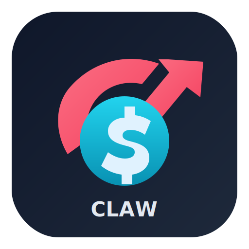
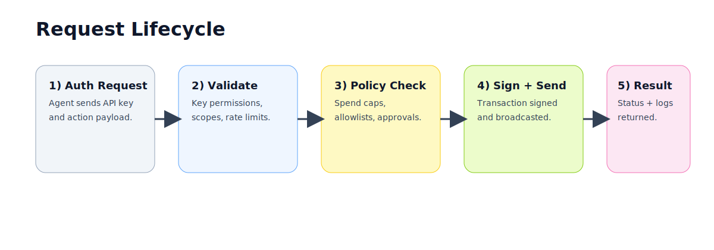

# Claw Wallet

<p align="center">
  
</p>

<p align="center">
  <strong>Wallet infrastructure for AI agents.</strong><br/>
  Create wallets, control spending policies, and run secure transactions across multiple chains with a single API.
</p>

<p align="center">
  
</p>

---

## Table of Contents

1. [What is Claw Wallet?](#what-is-claw-wallet)
2. [How it works](#how-it-works)
3. [Core features](#core-features)
4. [Project structure](#project-structure)
5. [Quick start](#quick-start)
6. [Configuration](#configuration)
7. [API usage](#api-usage)
8. [Policy and security model](#policy-and-security-model)
9. [Dashboard and SDKs](#dashboard-and-sdks)
10. [Development workflow](#development-workflow)
11. [Troubleshooting](#troubleshooting)
12. [License](#license)

---

## What is Claw Wallet?

Claw Wallet is a multi-chain wallet service designed for AI agents and automation systems. It gives your agent a programmable wallet with authentication, policy controls, and transaction tooling so you do not need to build key management and signing infrastructure from scratch.

Use it when you need to:
- create and manage agent wallets,
- sign and send transactions safely,
- enforce spend limits and allowlists,
- connect agent workflows through HTTP/MCP interfaces.

---

## How it works

<p align="center">
  
</p>

1. Your application or agent sends an authenticated API request.
2. Claw Wallet validates the API key and permission scope.
3. The policy engine checks spend limits, recipient rules, and approval requirements.
4. If approved, Claw Wallet signs and broadcasts the transaction on the selected chain.
5. The service returns status and records events for monitoring/audit.

---

## Core features

- **Multi-chain support** for EVM and non-EVM ecosystems.
- **API key authentication** with role-based permissions.
- **Policy engine** for budget constraints and risk controls.
- **Agent identity support** with ERC-8004 integrations.
- **Dashboard** for operational management.
- **Python and JavaScript tooling** for rapid integration.

---

## Project structure

- `agent-wallet-service/` → core API service and policy runtime
- `agent-wallet-service-dashboard/` → dashboard UI
- `agent-wallet-service-python/` → Python package/client
- `docs/` → release notes, planning docs, and visual assets

---

## Quick start

### Prerequisites

- Node.js 18+
- npm

### 1) Run the API service

```bash
git clone https://github.com/Vibes-me/Claw-wallet.git
cd Claw-wallet/agent-wallet-service
npm install
npm start
```

By default, the service starts on `http://localhost:3000`.

### 2) Create or reveal an admin API key

```bash
# show bootstrap secret on startup
SHOW_BOOTSTRAP_SECRET=true npm start
```

Or read from generated key store:

```bash
node -e "console.log(JSON.parse(require('fs').readFileSync('api-keys.json','utf8'))[0].key)"
```

### 3) Create your first wallet

```bash
curl -X POST http://localhost:3000/wallet/create \
  -H "Content-Type: application/json" \
  -H "X-API-Key: sk_live_YOUR_KEY" \
  -d '{
    "agentName": "DemoAgent",
    "chain": "base-sepolia"
  }'
```

---

## Configuration

Core environment variables used by the service:

- `PORT` → API port (default `3000`)
- `SHOW_BOOTSTRAP_SECRET` → print generated admin key when true
- `NODE_ENV` → runtime mode (`development`, `production`)

See `agent-wallet-service/.env.example` for a fuller template.

---

## API usage

### List wallets

```bash
curl http://localhost:3000/wallet/list \
  -H "X-API-Key: sk_live_YOUR_KEY"
```

### Check balance

```bash
curl http://localhost:3000/wallet/0xYOUR_ADDRESS/balance \
  -H "X-API-Key: sk_live_YOUR_KEY"
```

### Send a transaction

```bash
curl -X POST http://localhost:3000/wallet/0xYOUR_ADDRESS/send \
  -H "Content-Type: application/json" \
  -H "X-API-Key: sk_live_YOUR_KEY" \
  -d '{
    "to": "0xRECIPIENT",
    "value": "0.001"
  }'
```

---

## Policy and security model

Claw Wallet is built to minimize operational risk:

- **Least privilege**: issue keys with minimal permissions.
- **Policy-first execution**: transaction requests are filtered by policy before signing.
- **Operational controls**: set transaction ceilings and recipient controls.
- **Auditability**: keep request/transaction logs for incident response.

Recommended production practices:

1. Rotate API keys regularly.
2. Run behind TLS and an API gateway.
3. Keep strict per-environment key segregation.
4. Use dedicated RPC providers and monitoring alerts.

---

## Dashboard and SDKs

- Dashboard app: `agent-wallet-service-dashboard/`
- Python package: `agent-wallet-service-python/`
- JavaScript examples and CLI: `agent-wallet-service/`

If you need UI-based wallet operations, start the dashboard and point it at your running API service.

---

## Development workflow

```bash
# service
cd agent-wallet-service
npm install
npm test

# dashboard
cd ../agent-wallet-service-dashboard
npm install
npm run build
```

Use feature branches and keep docs + API examples updated when adding endpoints or policy behavior.

---

## Troubleshooting

- **401 Unauthorized**: confirm `X-API-Key` and key status.
- **Insufficient funds**: verify network, gas token balance, and decimals.
- **Policy rejection**: inspect allowlist/limit settings.
- **RPC errors**: validate provider URL and chain configuration.

---

## License

Apache-2.0. See `LICENSE` for details.
